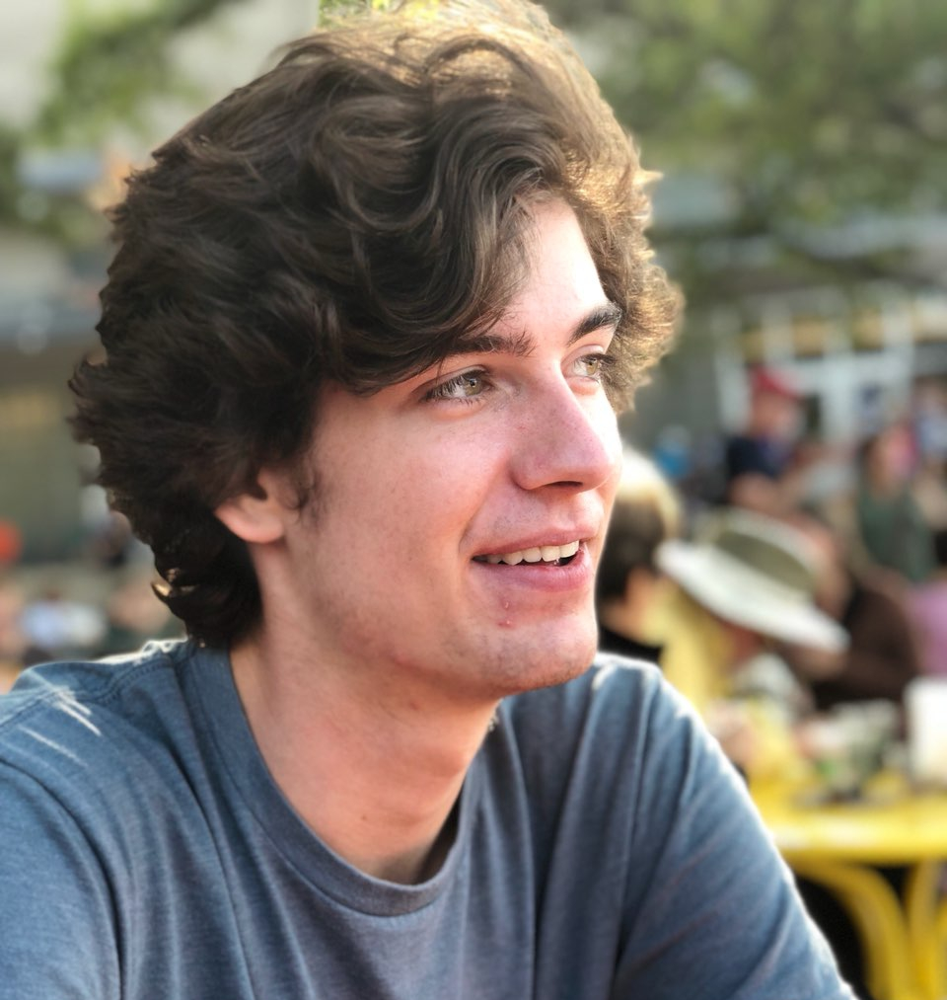

## AI@UW Leadership

### President, Study Group Leader

Declan Campbell joined AI@UW in fall 2017 and is a sophomore studying Computer Science and Neurobiology at the University of Wisconsin. In past internships, Declan has applied [autoencoders](http://ufldl.stanford.edu/tutorial/unsupervised/Autoencoders/) to the task of unsupervised anomaly detection and worked to identify anomalies in non-stationary time series data. Declan is leading the [study-tensorflow group](https://ai-club-uwmadison.github.io/projects/) this semester and is excited to help you learn more about AI!

### Vice President, Engineering Manager, Study Group Leader

[Chris Endemann](https://www.linkedin.com/in/chris-endemann/) helped co-found AI@UW in 2017, and has since played a lead role in managing and directing the club's operations. His interest in AI/ML research stems primarily from his love for reverse engineering the neural algorithms controlling sensation (qualia), perception (categorization of qualia), memory processing, and decision-making behavior. Under the mentorship of [Dr. Matthew Banks](https://neuro.wisc.edu/staff/banks-matthew-i/) and [Dr. Barry Van Veen](https://directory.engr.wisc.edu/ece/Faculty/Vanveen_Barry/), he is currently applying multivariate time-series modeling techniques to reveal the neural connectivity dynamics underlying conscious and unconscious sensory processing. In his spare time, Chris enjoys leading the [Algorithmic Trading Team](https://ai-club-uwmadison.github.io/projects_study-groups/) and the [Neuro-Inspired AGI](https://ai-club-uwmadison.github.io/projects_study-groups/) study group.

### Head of Engineering

[Abhay Venkatesh](http://abhayvenkatesh.com) co-founded AI@UW in April, 2017, and served as the founding President for the club. In the past, he has interned and worked with [Facebook](https://facebook.com), [Stanford](https://stanford.edu), and [MIT](https://mit.edu). Currently, he is responsible for advising the club on operations, and heading the engineering efforts of the club. He is a research assistant for [Dr. Vikas Singh](http://www.biostat.wisc.edu/~vsingh/), doing work in Computer Vision and Machine Learning.

### Head of Finance

[Rakshith Padmanabha](https://www.linkedin.com/in/rakshith-p/) co-founded AI@UW in April, 2017, and is responsible to manage and budget funds for the club. In the past, he has interned and worked with [Zynga](https://www.zynga.com).

### Head of Marketing

[Keshav Sharma](https://www.linkedin.com/in/keshav1905/) co-founded AI@UW in 2017, and has been leading the club's marketing. He has mentored [Stanford's online course on Machine Learning](https://www.coursera.org/learn/machine-learning) taught by Andrew Ng.  Keshav has also interned at [UW's IoT Research Center](https://iotcenter.engr.wisc.edu/) and [Pivotal](http://pivotal.io). Currently, he is working with [Google](https://google.com) to improve onboarding of students onto Cloud technologies. Upon graduation, Keshav will be joining [Pivotal](https://pivotal.io) as a product manager. 

### Head of Business Development

Nickolas Comeau joined AI@UW in January, 2018, and was invited to the executive board during the following summer. He is particularly interested in computational biology and exploring machine learning through the lense of neuroscience. His current role in the organization is to assist in the management of a learning group on Tensorflow, assist with general administrative tasks, and explore possible sponsorship and fundraising opportunities.

### Engineering Manager

Zhichun Huang joined AI@UW in October, 2017. He is a machine learning enthusiast, a hardcore gamer, and a soda addict. He is the engineering manager for the [Kaggle Team](https://ai-club-uwmadison.github.io/projects_study-groups/).

[Dandi Chen](https://sites.google.com/view/dandic/home) joined AI@UW in October, 2018. She holds a computer science master degree and now is majored in biomedical data science at [UW-Madison](https://www.wisc.edu/). Prior to Madison, she worked at [Weill Cornell Medicine](https://weill.cornell.edu/) for applying machine learning algorithms to biomedical applications. Her research interests are machine learning, computer vision, natural language processing, health informatics, etc. She is leading [Skin Lesion Analysis Team](https://ai-club-uwmadison.github.io/projects_study-groups/) at AI@UW.
